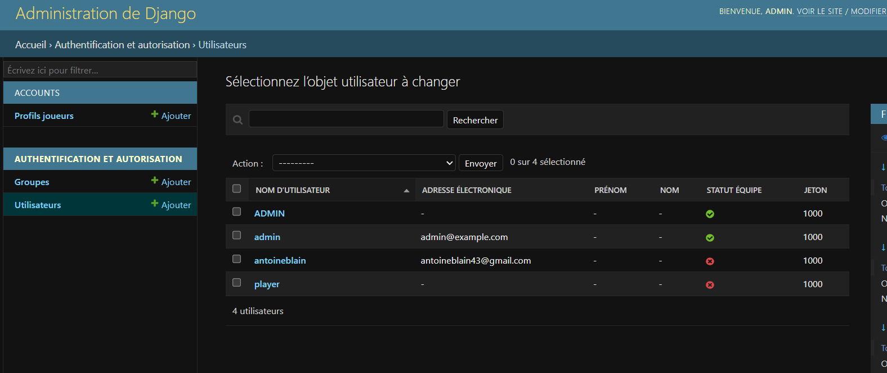

# BlackJack Django

## 1. Presentation

**Projet ecole : application web de BlackJack avec Django**

| Element | Valeur |
| --- | --- |
| Nom & Prenom | BLAIN Antoine, PECONTAL Corentin, MARTIN Evan |
| Formation | Master |
| Cours | Django |
| Jeu choisi | BlackJack |

Ce projet est une application web de BlackJack developpee avec Django selon une
architecture MVT. L'application permet a un utilisateur de creer un compte, de
se connecter, de choisir un avatar et de jouer au BlackJack avec un systeme de
jetons.

Le projet utilise :

- Django pour l'application web
- PostgreSQL pour la base de donnees
- Redis pour les sessions et le cache
- Docker Compose pour lancer l'infrastructure complete
- Gunicorn pour executer Django dans le conteneur web
- Black et Ruff pour la qualite du code Python

### Regles du jeu retenu

Le joueur commence une partie avec une mise en jetons. Deux cartes sont
distribuees au joueur et au croupier. Une carte du croupier reste cachee.

Le joueur peut ensuite :

- **Hit** : piocher une carte
- **Stand** : rester
- **Double** : doubler sa mise et recevoir une carte supplementaire

Le but est d'obtenir un score le plus proche possible de **21** sans le
depasser. Si le joueur depasse 21, il perd automatiquement. Sinon, le croupier
pioche jusqu'a atteindre au moins 17. Le gagnant est celui qui a le meilleur
score sans depasser 21.

## 2. Guide de demarrage rapide

### Prerequis

Avant de lancer le projet, il faut avoir :

- Docker
- Docker Compose
- Git

### Configuration

Cloner le projet :

```powershell
git clone https://github.com/RAYWINN43/projet_django_CARD
cd projet_django_CARD
```

Creer un fichier `.env` a partir du fichier d'exemple :

```powershell
copy .env.example .env
```

Puis completer les variables necessaires dans `.env`.

Le fichier `uv.lock` doit etre present dans le depot. La commande `uv lock` est
necessaire uniquement si les dependances Python sont modifiees dans
`pyproject.toml`.

### Lancer le projet

Depuis la racine du projet :

```powershell
docker compose up --build
```

L'application est accessible ici :

```text
http://127.0.0.1:8000/
```

## 3. Architecture logicielle

### Architecture du projet
Le projet suit l'architecture MVT de Django :


### Diagramme de classes


### Machine a etats des tours de jeu


## 4. Journal d'architecture

### Choix techniques

Le projet utilise Django pour beneficier de son systeme d'authentification, de
son ORM, de sa protection CSRF et de son interface d'administration.

PostgreSQL est utilise comme base de donnees principale afin de stocker les
utilisateurs, les profils joueurs et les parties.

Redis est utilise pour la gestion des sessions et du cache.

### Infrastructure Docker

Le projet contient :

- un service `web` pour l'application Django
- un service `db` pour PostgreSQL
- un service `cache` pour Redis
- des volumes nommes pour conserver les donnees PostgreSQL et Redis
- un reseau Docker prive
- des healthchecks sur PostgreSQL et Redis
- un `depends_on` pour attendre que les services soient prets

### Difficultes rencontrees

Pendant le developpement, plusieurs points ont demande une attention
particuliere :

- comprendre de django (pas familier avec le MVT)
- Compilation docker a chaque modif devoir tout rebuild 
- comprendre et configurer Black, Ruff dans un GitHub Actions

### Solutions mises en place

Version sans connexion à la base de données, afin de ne pas avoir à lancer Docker pour les modifications visuelles ou les changements qui ne nécessitent pas la base de données.

Le projet utilise aussi Black et Ruff pour ameliorer la qualite du code :

```powershell
uv run black --check .
uv run ruff check .
```

Ces commandes sont integrees dans la CI GitHub pour verifier en auto le projet a chaque push ou pull.


### Capture d'ecran de l'interface principale
page admin de django : 
maquette Figma : 
en jeux : 