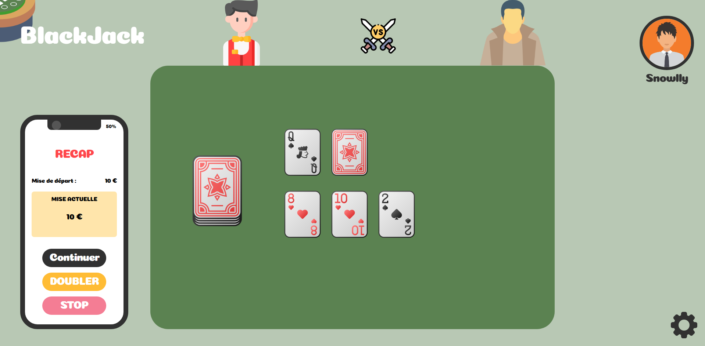
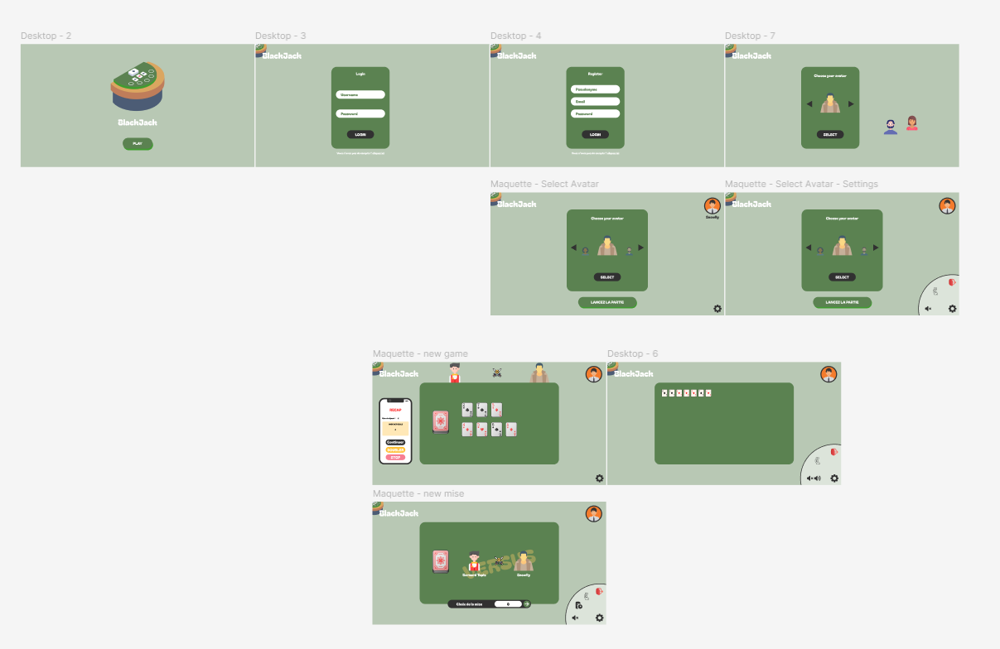

# BlackJack Django

Projet scolaire de plateforme de BlackJack réalisé avec Django par Antoine BLAIN,
Corentin PECONTAL et Evan MARTIN (Master). L’application permet de créer un
compte, choisir un avatar, miser des jetons et jouer une partie complète contre
le croupier « Bernard Tapis ».

## Règles retenues

Deux cartes sont distribuées au joueur et au croupier, dont une carte cachée
chez le croupier. Les figures valent 10 et l’as vaut 1 ou 11. Le joueur peut :

- `Continuer` : piocher une carte ;
- `Stop` : terminer son tour ;
- `Doubler` : doubler sa mise, piocher une dernière carte, puis terminer son tour.

Le croupier pioche jusqu’à 17. Le meilleur total inférieur ou égal à 21 gagne.
Une égalité rend la mise ; une victoire rend la mise et crédite un gain identique.



## Démarrage rapide

### Prérequis

- Docker avec Docker Compose ;
- Git.

### Installation en une commande

```powershell
git clone https://github.com/RAYWINN43/projet_django_CARD
cd projet_django_CARD
copy .env.example .env
docker compose up --build
```

L’application est ensuite accessible sur <http://127.0.0.1:8000/> et
l’administration sur <http://127.0.0.1:8000/admin/>.

Le démarrage exécute les migrations, collecte les fichiers statiques à la
construction et crée le superutilisateur décrit par les variables
`DJANGO_SUPERUSER_*` du fichier `.env`. Pour créer un autre administrateur :

```powershell
docker compose exec web python manage.py createsuperuser
```

Pour arrêter l’application sans supprimer les données :

```powershell
docker compose down
```

PostgreSQL et Redis utilisent des volumes nommés. `docker compose down -v`
supprime aussi ces données et doit donc être utilisé avec prudence.

### Configuration locale et production

`.env.example` contient les variables PostgreSQL, Redis, comptes de démonstration
et Django. En production, utiliser des secrets uniques, renseigner les domaines
réels dans `DJANGO_ALLOWED_HOSTS` et `DJANGO_CSRF_TRUSTED_ORIGINS`, puis activer :

```dotenv
DJANGO_DEBUG=0
DJANGO_SECURE_SSL_REDIRECT=1
DJANGO_SESSION_COOKIE_SECURE=1
DJANGO_CSRF_COOKIE_SECURE=1
DJANGO_SECURE_HSTS_SECONDS=31536000
DJANGO_SECURE_HSTS_INCLUDE_SUBDOMAINS=1
DJANGO_SECURE_HSTS_PRELOAD=1
DJANGO_BEHIND_HTTPS_PROXY=1
```

Les valeurs HTTP de `.env.example` sont volontairement adaptées au lancement
local sans certificat TLS.

## Architecture logicielle

Le projet suit l’architecture MVT :

- **Models** : `Profile`, `Game` et `MoveLog` stockent joueurs, parties, état,
  cartes, mises et historique ;
- **Views** : authentification, validation des formulaires, permissions et
  orchestration transactionnelle des actions ;
- **Templates** : écrans d’accueil, authentification, avatar et table de jeu ;
- **Moteur** : `game/game_engine.py` contient les objets purs `Card`, `Deck`,
  `Player`, le mélange, le calcul des points et l’évaluation du résultat.

Les règles ne dépendent donc ni des requêtes HTTP ni du rendu HTML. Les vues
n’acceptent les mises et coups qu’en `POST`, valident le CSRF, verrouillent la
partie pendant une action et vérifient que le joueur en est propriétaire.

### Machine à états

| État | Actions permises | État suivant |
| --- | --- | --- |
| `waiting` | création de la partie et mise valide | `player_turn` |
| `player_turn` | hit | `player_turn` ou `dealer_turn` si dépassement |
| `player_turn` | stop ou double | `dealer_turn` |
| `dealer_turn` | pioche automatique et calcul du résultat | `finished` |
| `finished` | aucune action de jeu ; rejouer crée une nouvelle partie | — |

Chaque distribution, pioche, stop, double et résultat est ajouté à `MoveLog`
avec l’acteur, la carte éventuelle et les détails du coup.

- [Diagramme d’architecture](architecture.puml)
- [Diagramme de classes](classe.puml)
- [Machine à états](state-machine.puml)

## UI/UX, Design Tokens et Atomic Design

Les variables globales de `front/styles.css` centralisent la palette, les
couleurs des quatre enseignes, les espacements, rayons, ombres, typographies et
états victoire/défaite. Les feuilles d’écran réutilisent exclusivement ces
tokens pour éviter les couleurs dispersées.

La hiérarchie suit Atomic Design :

- **Atomes** : boutons `.game-action`, cartes `.playing-card`, badges de solde ;
- **Molécules** : mains `.game-hand`, pioche `.game-deck`, barre de mise et zone
  d’actions ;
- **Organismes** : table `.game-table`, téléphone récapitulatif, panneau des
  paramètres et écran de fin.

Les retours utilisateur combinent états actifs, transitions CSS, annonces
accessibles `aria-live` et sound design séparé : ambiance, distribution,
victoire et défaite. La position de l’ambiance est conservée entre deux actions
de jeu afin qu’une pioche ne redémarre pas la musique.



## Infrastructure

- image `python:3.11-slim` et dépendances installées avec `uv` ;
- application Gunicorn exécutée par un utilisateur Linux non-root ;
- PostgreSQL 16 et Redis isolés sur `blackjack_network` ;
- volumes persistants `postgres_data` et `redis_data` ;
- healthchecks et `depends_on` avec condition de bonne santé ;
- secrets et adresses transmis par variables d’environnement.

## Tests et qualité

Exécution locale :

```powershell
uv run black --check .
uv run ruff check . --no-cache
uv run python manage.py test
uv run python manage.py check
```

La suite couvre notamment le paquet de 52 cartes, la pioche, les as multiples,
les scores, les mises invalides, le double sans solde, les transitions d’état,
les journaux de coups, l’authentification, les permissions de propriété, POST et
CSRF. GitHub Actions exécute migrations, tests, Black, Ruff et le system check à
chaque push et pull request ciblé.

## Journal d’architecture

### Répartition du travail

| Membre | Contribution principale |
| --- | --- |
| Evan MARTIN | direction UI/UX, maquettes, intégration responsive et sound design |
| Antoine BLAIN | backend Django, modèles et logique de jeu |
| Corentin PECONTAL | authentification, infrastructure Docker/Redis/PostgreSQL et CI |

Le travail croisé et les revues restent visibles dans l’historique Git ; chaque
membre doit être capable d’expliquer les portions qu’il présente.

### Difficultés et solutions

- **Persistance d’une partie** : les objets du moteur sont sérialisés dans les
  champs JSON de `Game`, puis reconstruits à chaque requête.
- **Séparation MVT/SRP** : le calcul des cartes a été extrait des vues vers un
  moteur Python pur, ce qui rend les règles testables sans navigateur.
- **Actions concurrentes et triche côté client** : mises et coups sont validés
  côté serveur, sous transaction, avec vérification du propriétaire.
- **Environnement complet coûteux à relancer** : SQLite reste disponible pour
  les tests rapides, tandis que Compose reproduit PostgreSQL et Redis pour le
  rendu.
- **Audio interrompu par les transitions** : chaque effet possède son lecteur
  et la position de l’ambiance est restaurée après navigation.


Capture de l’administration Django :


